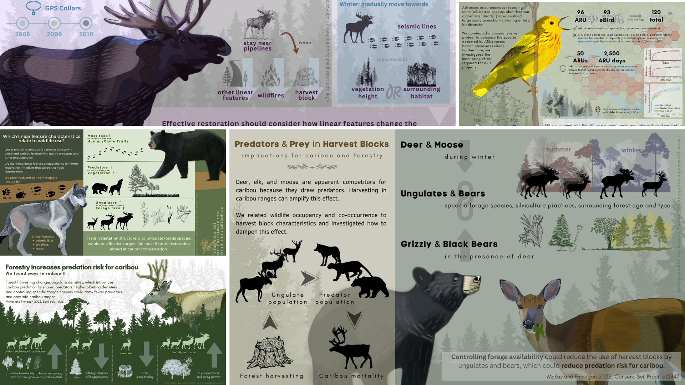

# Fact Sheet for Grassland Birds

## About

This project is iniciated by Bird Ecology & Conservation Ontario (BECO). The goal is to create a 2-page grassland bird fact sheet for landowners. 

- [Bird Life in Agricultural Grasslands](https://grasslandbirds.ca/index.html)

- [Grasshopper Sparrow Fact Sheet](https://www.beco-birds.org/wp-content/uploads/2023/02/GrasshopperSparrow_FactSheet_BECO.pdf)

- [Nesting period of birds in the area](https://www.canada.ca/en/environment-climate-change/services/avoiding-harm-migratory-birds/general-nesting-periods/nesting-periods.html#_zoneC_calendar)

- Note: bird illustrations created by Emily S. Damstra for BECO can be used for this project as well.

## Product 

### version 1: 2024.03.05
[PDF file](./docs/Grassland_Bird_In_Ontario_v1.pdf)

## Time line

| Item | Due | Communication with client |
| ----------- | ------------- | ------ |
| Raw text content (receive) | Feb.2 |  |
| Summarized version of text | Feb.9 | agree on the text draft |
| Graphic design | Feb.25 | progress update |
| First version | Mar.3 | review of the product |
| Revision(s)* | Mar.10|  | 

*Sunny will provide 2 rounds of minor revisions for the final product. Minor revisions are usually within 1 hour of editing time for each round of revisions. After that it will be charged $35 per hour.

## Expected output

- Dimension: letter size document (8.5 by 11 inches), 2 pages
- Orientation: Vertical
- Color: coloured
- File type: PDF

## Expected compensation

The hourly rate for the work is $35, and I anticipate the project will require approximately 25 to 28 working hours. This translates to a total cost ranging from $875 to $980.

| Expected hours | Task |
| --- | --- |
| 6 | materials collection and text processing |
| 4 | communication (email, video call) |
| 10 | visual design |
| 4 | text design |
| 2 | review and final editing of the work |
| 2 | others |

## Tools

I will be using these platforms for designing: 

- [GIMP](https://www.gimp.org/): an image editor for most of the visual design, including digital drawing.

- [Krita](https://krita.org/en/): a professional open source painting program

- [Canva](https://www.canva.com/): a design tool for presentations and social media. I will be using canva for the text design. 

My design style. Visit my website to view more previous works: https://sunshineland.netlify.app/infographic/

## References

- [FUSE consulting company](https://www.fuseconsulting.ca/infographics)
- [FRI research](https://friresearch.ca/search/?frisearchable_posts%5BhierarchicalMenu%5D%5Btaxonomies_hierarchical.publication_type.lvl0%5D%5B0%5D=Summaries%20and%20Communications&frisearchable_posts%5BhierarchicalMenu%5D%5Btaxonomies_hierarchical.publication_type.lvl0%5D%5B1%5D=Infographics)

